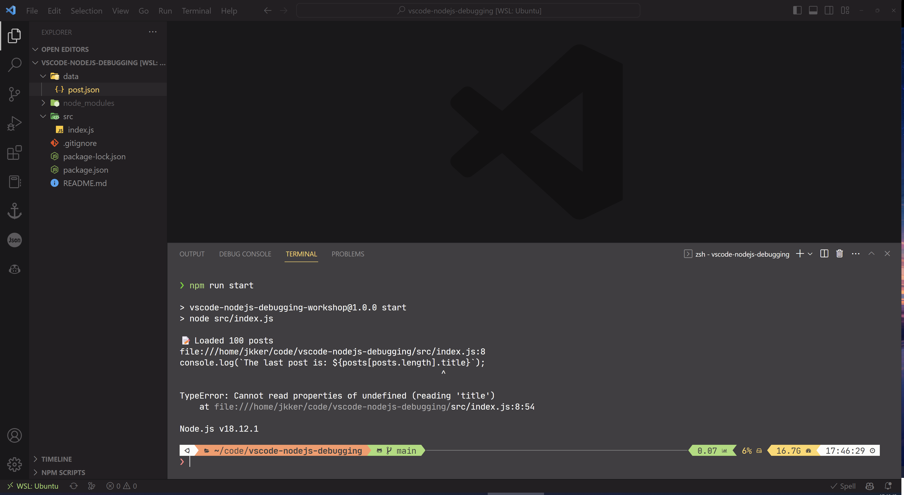
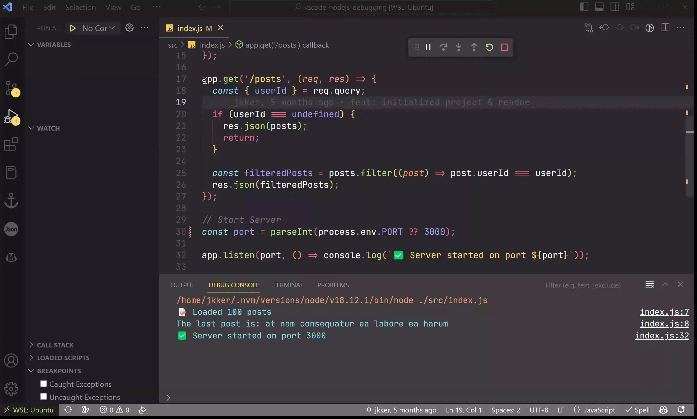

# Workshop: Node.js debugging in VS Code

Debugging is life and it’s hard. In this workshop, we will learn how to use the VSCode debugger for JavaScript to make our life easier.

## Table of Contents

- [Getting Started](#getting-started)
- [What’s in an Error Message](#whats-in-an-error-message)
- [Why Do We Need a Debugger?](#why-do-we-need-a-debugger)
- [Launching the Debugger](#launching-the-debugger)
- [Using Breakpoints](#using-breakpoints)
- [Navigation](#navigation)
- [Watch Panel \& Debug Console](#watch-panel--debug-console)
- [References](#references)


## Getting Started

1. Clone this repository

    ```bash
    git clone git@github.com:Jkker/vscode-nodejs-debugging.git
    ## or
    git clone https://github.com/Jkker/vscode-nodejs-debugging.git
    ```

2. Install Dependencies

    ```bash
    cd vscode-nodejs-debugging
    npm i
    ```


## What’s in an Error Message

Let’s run our program and see what happens! We can use the `start` script we defined in our `package.json` with `npm run start` or manually type `node src/index.js`.



Oops, we got an issue. Luckily, we can locate it by hover on the error path and open it using `ctrl + click.`


This brings us directly to line 8 where this error occurs.

Let’s take another look at the most important part of our error message:

> Cannot read properties of undefined (reading 'title')
>

This means that we are accessing the property `title` on something that’s `undefined`.

In this case, it’s `posts[posts.length]`. Because JavaScript is 0-indexed, this points to somewhere outside this array. So, we should change it to  `posts[posts.length - 1]` or `posts.at(-1)` to access the last element.


Run the program again and see if you can help me fix the second error!

<details><summary><b>Spoil Alert ⚠️</b></summary>
<p>

`process.env.PORT` is `undefined`, so `parseInt(undefined)` outputs `NaN` and causes `app.listen()` to throw this error.

To fix this, we can move `?? 3000` inside `parseInt`.  `??` here is the [Nullish coalescing operator](https://developer.mozilla.org/en-US/docs/Web/JavaScript/Reference/Operators/Nullish_coalescing). It returns its right-hand side when its left-hand side is `null` or `undefined`.


</p>
</details>

## Why Do We Need a Debugger?

Once we got those errors fixed, we can finally start our server successfully on port 3000.

We can verify that our app is up and running using curl. However, looks like our `GET /posts` route isn’t doing that well: our `userId` filter doesn’t work. It returns an empty array, though we obviously have some posts from user 1 in our json.


Since we don’t have an error message, it might be hard to find out where this bug occurs. This is one of the reasons why we need a debugger. Other reasons include:
1. **Code hygiene**: we can use the debugger to inspect the state of our program without polluting our code with `console.log()` and other statements.
2. **Navigation**: we can use the debugger to navigate through our code step by step, which is especially useful when we are dealing with asynchronous code.

## Launching the Debugger

1. You can open the VSCode Debugger by clicking on the Debug icon in the left sidebar, or by pressing **`Ctrl+Shift+D`** on Windows or **`Command+Shift+D`** on Mac.
2. Click `Run and Debug`
    1. VS Code will try to automatically detect your debug environment, but if this fails, you will have to choose it manually. In this case, we should select `Node.js`.
    2. This will run the currently active file in your editor, so make sure that the entry point of your program (e.g. `index.js`) is active, instead of something like `layout.hbs`.
3. Optionally, you can click on the gear icon open the `launch.json` configuration. This is where you can set environmental variables, command line arguments, working directory, etc. Details can be found here: **[Launch.json attributes](https://code.visualstudio.com/Docs/editor/debugging#_launchjson-attributes).**

## Using Breakpoints

Our app is now running normally as if we ran it from our terminal. To find out what happens when we visits `/posts`, we should add a breakpoint on line `18` to allow us to inspect the state of our program. Right click on the red dot that appears when you hover on the left-side of the line number to bring up the menu.



Now, restart our program by clicking on the restart button on the floating toolbar.


Once we’ve sent a request to `posts?userId=1` (via a browser or `curl`), our debugger pauses our program **before** it runs line 18. On the left variables panel, we can see that userId is `undefined` because of this.

## Navigation

Next, click `Step Over ⤵️` (the 2nd button) on the floating toolbar to move on to the next line of code.


While our code is running, we can add another breakpoint at line 25 to take a closer look at how the filtering goes. Then, click `Continue▶️` (the first button) to let our debugger move on to the next breakpoint if there’s any.

Once we hit line 25, click `Step Into ⬇️` so we can dive into the callback function of `posts.filter()`.

## Watch Panel & Debug Console

Let’s add those variables that we are interested into the `Watch` panel. You can also hover your mouse on them in your code to see their values.


They look different, right? Let’s verify this with the Debug Console.

Everything we run in the debug console are evaluated under the current scope of our running program. In this case, I use the `typeof` operator to check these variable’s types. You can also type an expression here or in the `Watch` panel like `userId == post.userId`.


To fix this, we can either change the [strict equality](https://developer.mozilla.org/en-US/docs/Web/JavaScript/Reference/Operators/Strict_equality) operator `===` to `==` or do a type conversion.

Voilà! Restart the debugger and test it out. Our program should be running as expected now.

## References

[https://code.visualstudio.com/docs/editor/debugging](https://code.visualstudio.com/Docs/editor/debugging)

[https://code.visualstudio.com/docs/nodejs/nodejs-debugging](https://code.visualstudio.com/docs/nodejs/nodejs-debugging)